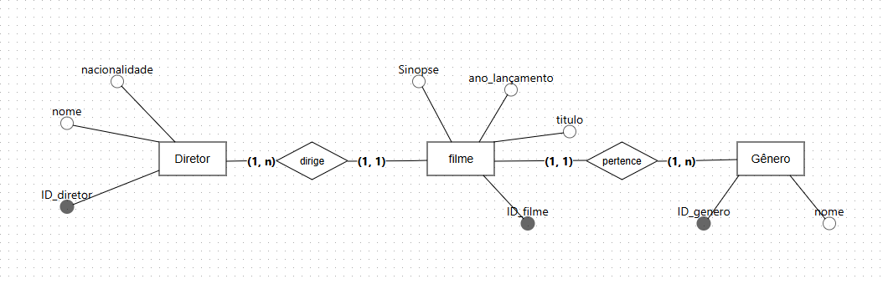
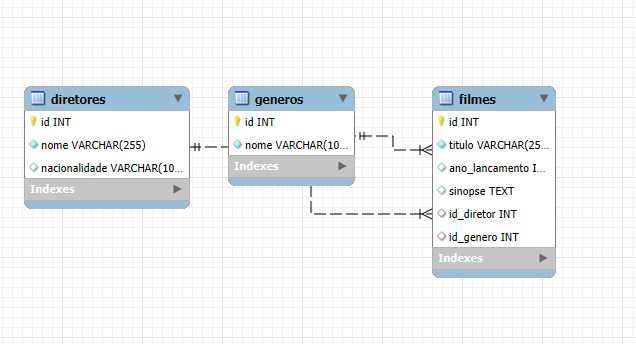
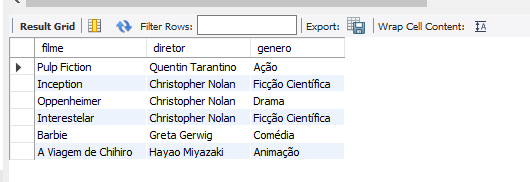
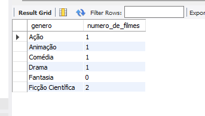

# Projeto de Banco de Dados de Filmes
### Visão geral 
#### Este projeto consiste na modelagem e implementação de um banco de dados relacional para gerenciar informações sobre filmes, diretores e gêneros.

### Programas usados.
- SGBD: MySQL
- Modelagem: BRModelo
- Linguagem de Consulta: SQL

---

### Modelagem do Banco de dados
#### Abaixo é a imagem representando o modelo conceitual utilizado para estruturar o banco de dados do projeto.

### Foram modelas 3 entidades principais
 - Diretor 
 - Filme
 - Gênero

 ### Relacionamentos Filme - Diretor 
 -  Um Filme é dirigido por um e apenas um Diretor.
 -  Um Diretor pode dirigir um ou muitos Filmes

 #### Filme e gênero 
 - Um Filme pertence a um e apenas um Gênero.
 - Um Gênero pode estar associado a um ou muitos Filmes.

 ---
 ### Modelo lógico e físico
#### O modelo lógico é em base no conceitual

---

### Consultas exemplos
#### exemplo 1
- Listar todos os filmes com seus diretores e gêneros

---
#### exemplo 2
-  Encontrar todos os filmes dirigidos por 'Christopher Nolan'

---
### exemplo 3
 -  Contar quantos filmes existem de cada gênero

---